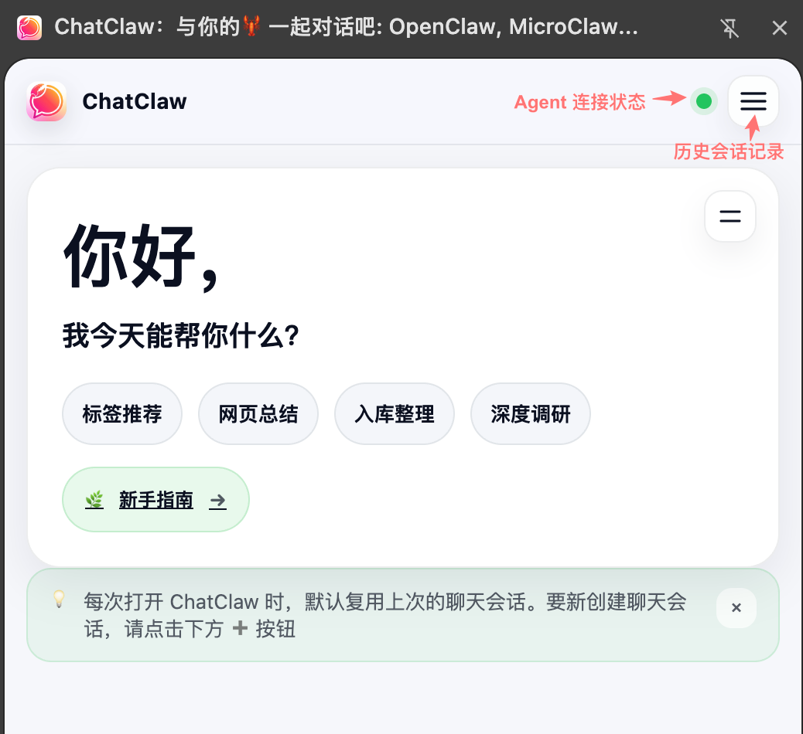
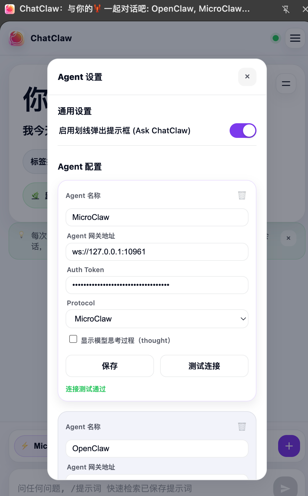
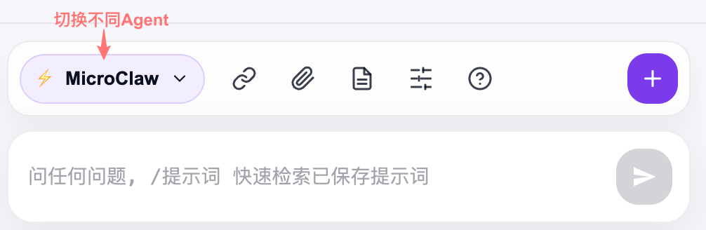
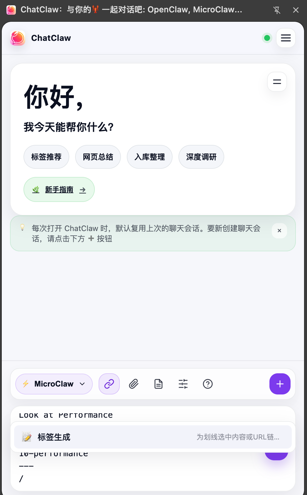
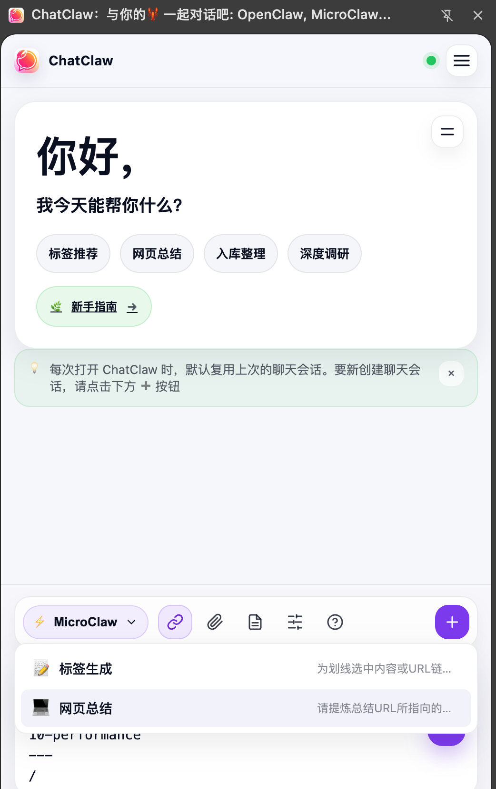
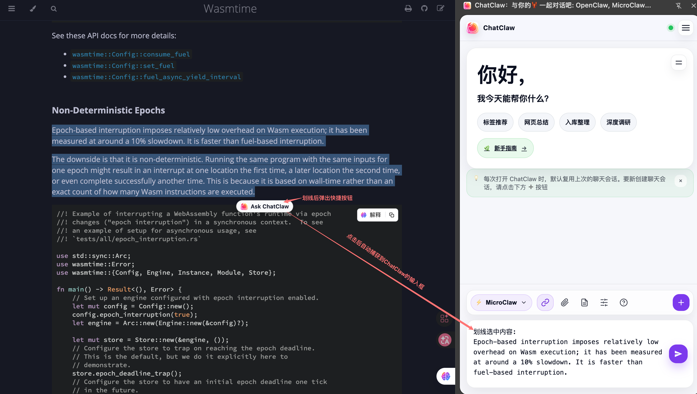

<div align="center">
  
</div>

# ChatClaw Chrome 扩展插件

**ChatClaw** 是一款现代化的 Chrome 扩展，作为浏览器与 AI Agent 之间的桥梁。它提供了持久化的侧边栏界面，让你在浏览网页时也能与 Agent 实时对话、附加上下文并完成智能化任务。

> [!NOTE]
> 此扩展需要后端 Agent 服务支持 WebSocket 协议（如 [MicroClaw](https://github.com/microclaw/microclaw)、[OpenClaw](https://github.com/openclaw/openclaw)）。
> 如果 Agent 服务与浏览器在同一台机器上，可使用 `ws://` 地址（如 `ws://127.0.0.1:18789`）。
> 如果 Agent 服务与浏览器不在同一台机器上，推荐使用 TLS 加密的 `wss://` 地址（如 `wss://127.0.0.1:18789`）。

## ✨ 功能特性

- **无缝侧边栏界面**：持久化面板，浏览网页时持续提供 AI 辅助。
- **实时 WebSocket 通信**：低延迟、双向流式响应。
- **多 Agent 支持**：在设置中配置多个 Agent，并在界面中快速切换。
- **上下文快速捕获**：一键附加当前网页 URL、标题和划线选中内容。
- **文件分析**：支持上传文本类文件（代码、日志、文档）供 Agent 分析。
- **提示词管理**：保存、检索并复用常用 Prompts，支持 `/<提示词名称>` 快捷调用。
- **实时连接状态**：通过状态点直观查看连接健康度。

## 🛣️ 路线图

ChatClaw 正在快速演进中。以下是接下来的开发计划：

- [x] **智能上下文感知**：即时附加当前网页标题和 URL，提升回答相关性。
- [x] **悬浮操作按钮**：网页划线后快速触发 Ask ChatClaw。
- [x] **Markdown 渲染**：更友好的结构化阅读体验。
- [x] **OpenClaw Agent 集成**：原生支持 OpenClaw 协议。
- [ ] **AI 驱动的提示词优化**：内置 Prompt 优化能力。
- [ ] **返回结果一键复制**：支持以 Markdown 格式快速复制回答。
- [ ] **文件分析一键上传**：提升附件上传和分析效率。
- [ ] **前端工具调用/Skill 激活可观测能力**：可视化展示 Agent 执行过程。

## 🚀 快速开始

### 前置要求

> [!IMPORTANT]
> 当前插件支持 OpenClaw Agent 和 MicroClaw Agent 服务。开始前请先确认 Agent 的 WS/WSS 地址可访问。

### 安装步骤

#### Chrome 商店安装

1. 访问 [ChatClaw Chrome 商店页面](https://chrome.google.com/webstore/detail/chatclaw/...)。
2. 点击 **添加到 Chrome** 按钮，确认安装。

#### 开发者模式

1. 克隆或下载本项目代码到本地机器。
2. 打开 Chrome 浏览器，访问 `chrome://extensions/`。
3. 在页面右上角开启 **开发者模式 (Developer mode)**。
4. 点击 **加载已解压的扩展程序 (Load unpacked)**，选择本项目所在的文件夹。
5. ChatClaw 图标将出现在浏览器工具栏中，建议固定到工具栏以便快速访问。

## 💡 使用指南

> [!TIP]
> 第一次使用建议按此顺序：`打开侧边栏 → 配置 Agent → 测试连接 → 发送第一条消息`。

### 1) 打开侧边栏（入口）

- 点击 Chrome 工具栏中的 **ChatClaw 图标**，右侧会弹出聊天面板。
- 顶部看到连接状态点和「历史会话」按钮，即表示已进入主界面。

图示（顶部区域）：



### 2) 配置 Agent（设置图标按钮）

点击工具栏中的 **设置（滑杆样式图标）**，进入 Agent 设置弹窗。每个 Agent 卡片支持：

- **Agent 名称**：用于在模型选择器中识别（例如「OpenClaw-生产」「MicroClaw-本地」）。
- **Agent 网关地址**：填写 `ws://` 或 `wss://` 地址。
- **Auth Token**：如果服务端要求鉴权则填写。
- **Protocol**：支持 `Auto-detect` / `OpenClaw` / `MicroClaw`。
- **显示模型思考过程（thought）**：按需开启。
- **保存**：保存当前卡片配置。
- **测试连接**：立即验证当前配置是否可连通。

图示（Agent 卡片）：


> [!IMPORTANT]
> 若 Agent 与浏览器不在同一台机器，推荐使用 `wss://` 协议保证安全性。

### 3) 管理多个 Agent（模型切换）

- 在设置页下方点击 **`+`** 按钮可新增 Agent。
- 在聊天输入框上方左侧点击 **模型胶囊按钮（⚡ 名称）**，可切换当前使用的 Agent。
- 切换后会按该 Agent 的配置重新连接，并加载对应会话上下文。

图示（底部工具条）：


### 4) 发送消息（最常用）

- 在输入框直接提问，按 **Enter** 发送。
- 需要换行时使用 **Shift + Enter**。
- 也可以点击右下角发送按钮（纸飞机）发送。

示例：


### 5) 添加网页上下文（🔗 按钮）

点击 **🔗 添加当前网页信息** 后，输入框会自动插入当前页面的标题与 URL，帮助 Agent 理解你正在看的内容。

插入效果示例：

```text
网页标题: Chrome Extensions - sidePanel
URL链接: https://developer.chrome.com/docs/extensions/reference/api/sidePanel
---
请用 5 句话总结这页内容
```

再次点击 🔗 可取消当前页面上下文的激活状态。

### 6) 上传本地附件（📎 按钮）

- 点击 **📎 添加附件**，选择本地文本类文件（如代码、日志、文档）。
- 上传后文件内容会作为上下文参与当前提问。

示例提问：

```text
这是我的报错日志，请定位根因并给出修复步骤。
```

### 7) 使用提示词库（📝 按钮 + `/` 快捷）

- 点击 **📝 提示词管理** 可新建、搜索、编辑常用提示词。
- 在输入框输入 `/` 可快速检索并插入已保存提示词。

示例：



### 8) 网页划线一键提问（Ask ChatClaw）

- 在任意网页中选中文本后，会出现悬浮按钮 **Ask ChatClaw**。
- 点击后会自动打开侧边栏，并把划线内容填入输入框。
- 若不需要该能力，可在设置中关闭 **启用划线弹出提示框 (Ask ChatClaw)**。

插入效果示例：


### 9) 会话管理（历史 / 新建）

- 顶部右侧 **历史会话（≡）**：查看并切换过去会话。
- 底部右侧 **新建会话（➕）**：快速开启全新对话，不污染当前上下文。


### 10) 连接状态怎么看

- 顶部状态点用于表示连接状态：
  - 灰色：未连接或连接断开
  - 绿色：连接正常
- 如果发送无响应，优先检查：
  1. Agent 服务是否启动；
  2. 网关地址是否可达（`ws://` / `wss://`）；
  3. Token 是否正确；
  4. 在设置中点击「测试连接」是否通过。

## 🛠️ 架构说明

该扩展基于标准 Web 技术和 Chrome Manifest V3 构建：

- `manifest.json`：定义权限（`sidePanel`、`activeTab`、`storage`）和扩展配置。
- `background.js`：Service Worker，负责扩展生命周期和侧边栏激活。
- `sidebar.html` / `sidebar.js` / `sidebar.css`：核心 UI、WebSocket 通信和会话状态管理。
